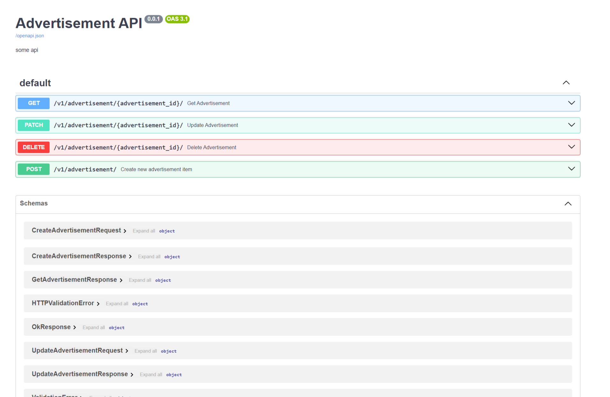

# Домашнее задание "Создание REST API на FastApi часть 2"

## `Порядок работы`

1. Запускаем Docker Desktop. В терминале выполняем команду

>   `docker-compose up --build`

создается контейнер с базой данных и приложением порт 8070. 
Заходим в браузере по адресу http://localhost:8070/docs#/ и работаем с запросами. Или через 
файл [client.py](client.py) с запросами, необходимо поменять 127.0.0.1:8000 на 127.0.0.1:8070

или
>   `docker-compose up db`

создается контейнер с базой данных. В этом случае приложение будет работать не из контейнера, а локально.
Заходим в браузере по адресу http://localhost:8000/docs#/ и работаем с запросами. Или через 
файл [client.py](client.py) с запросами, url: 127.0.0.1:8000

Настраиваем запуск приложения и запускаем его

2. Запускаем файл [scripts.py](app/scripts.py), в бд создается роль(Role) admin со всеми правами(Right)
и роль user с ограниченными правами. Создается юзер admin со всеми правами

3. Открываем файл [client.py](client.py)
Используем закомментированный код сперва для создания юзера (юзеров). Каждому юзеру (включая admin) 
создаем токен (авторизуемся). Далее каждый юзер может получить, изменить или удалить только свои данные
   (по своему `id` и токену). 
4. Админ может получить, изменить или удалить данные всех юзеров (любой `id` и свой токен).
5. Далее юзер может создать свое объявление (объявления) по токену. Изменить или удалить можно 
только свои объявления (по `id` своего объявления и своему токену). 
6. Админ может получить, изменить или удалить любое объявление (любой `id` объявления и свой токен).
7. Неавторизованный юзер (без токена) может получить любое объявление по его id или по заголовку
   (по полю title)
8. Для этого необходимо раскомментировать нужные команды вставить данные и запустить файл.
9. При работе в браузере по адресу http://localhost:8070/docs#/ или через 
файл [client.py](client.py) по адресу 127.0.0.1:8070 нужно запустить Docker-контейнер в Docker Desktop.
Запускать приложение в IDE не требуется.

# Домашнее задание к лекции «Создание REST API на FastApi» часть 2

Инструкцию по сдаче домашнего задания вы найдете  [на главной странице репозитория](https://github.com/netology-code/py-homeworks-web/tree/new). 

Ориентировочное время выполнения- 90 минут.

# Задание 
Вам нужно доработать проект из предыдущего задания «Создание REST API на FastApi» часть 1:

1. Добавить роут `POST /login` . В теле запроса должен передаваться JSON с именем пользователя и паролем.  Роут возвращает токен. В дальнейшем токен будет использоваться для авторизации.  Срок действия токена - 48 часов. Если клиент предоставил неверный логин пароль сервис должен выдать ошибку 401. 

2. Добавить роуты для управления пользователями:
- `GET /user/{user_id?}`
- `POST /user` 
- `PATCH /user/{user_id} `
- `DELETE /user/{user_id}`

  Пользователи должны принадлежать одной из следующих групп: user, admin

3. Права неавторизованного пользователя (клиент может токен не передавать):
- Создание пользователя `POST /user`
- Получение пользователя по id `GET /user/{user_id}`
- Получение объявления по id  `GET /advertisement/{advertisement_id}`
- Поиск объявления по полям `GET /advertisement?{query_string}`

4. Права авторизованного пользователя с группой user:
- все права неавторизованного пользователя
- обновление своих данных `PATCH /user/{user_id}`
- удаление себя `DELETE /user/{user_id}`
- создание объявления  `POST /advertisement`
- обновление своего объявления `PATCH /advertisement/{advertisement_id}`
- удаление своего объявления `DELETE /advertisement/{advertisement_id}`

5. Права авторизованного пользователя с группой admin:
- любые действия с любыми сущностям

Если у пользователя недостаточно прав для выполнения операции, то возвращается ошибка 403